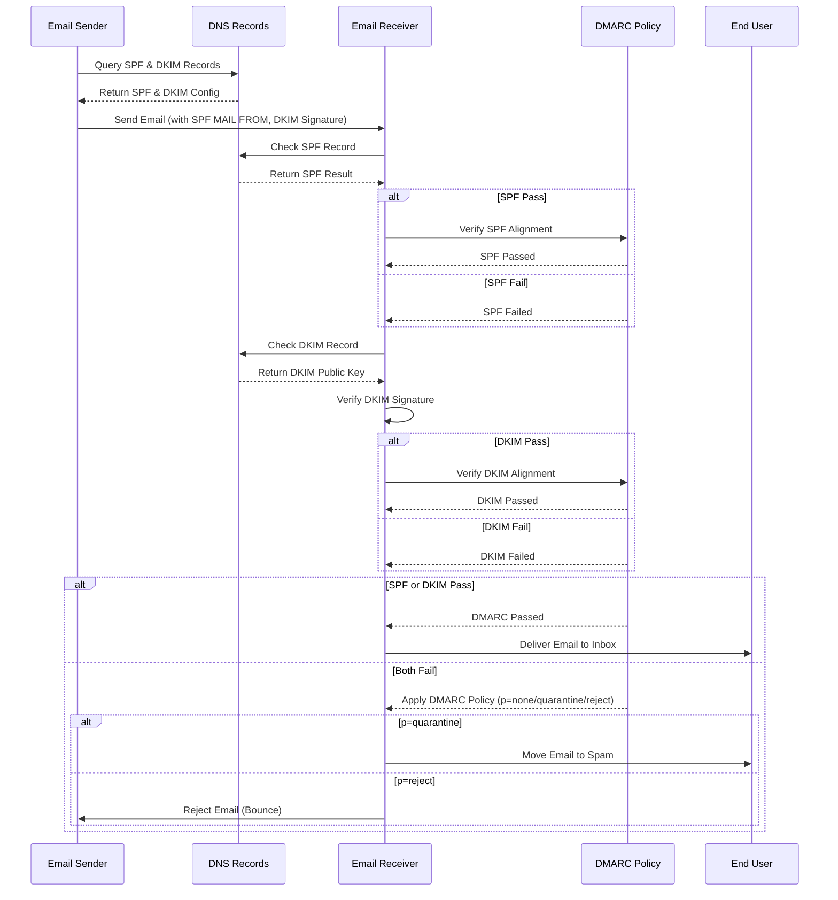

# DMARC-EMAIL-SECURITY

```mermaid
sequenceDiagram
    participant Sender as Email Sender
    participant DNS as DNS Records
    participant Recipient as Email Receiver
    participant DMARC as DMARC Policy
    participant User as End User
    
    Sender->>DNS: Query SPF & DKIM Records
    DNS-->>Sender: Return SPF & DKIM Config
    
    Sender->>Recipient: Send Email (with SPF MAIL FROM, DKIM Signature)
    
    Recipient->>DNS: Check SPF Record
    DNS-->>Recipient: Return SPF Result
    alt SPF Pass
        Recipient->>DMARC: Verify SPF Alignment
        DMARC-->>Recipient: SPF Passed
    else SPF Fail
        DMARC-->>Recipient: SPF Failed
    end

    Recipient->>DNS: Check DKIM Record
    DNS-->>Recipient: Return DKIM Public Key
    Recipient->>Recipient: Verify DKIM Signature
    alt DKIM Pass
        Recipient->>DMARC: Verify DKIM Alignment
        DMARC-->>Recipient: DKIM Passed
    else DKIM Fail
        DMARC-->>Recipient: DKIM Failed
    end

    alt SPF or DKIM Pass
        DMARC-->>Recipient: DMARC Passed
        Recipient->>User: Deliver Email to Inbox
    else Both Fail
        DMARC-->>Recipient: Apply DMARC Policy (p=none/quarantine/reject)
        alt p=quarantine
            Recipient->>User: Move Email to Spam
        else p=reject
            Recipient->>Sender: Reject Email (Bounce)
        end
    end
```
